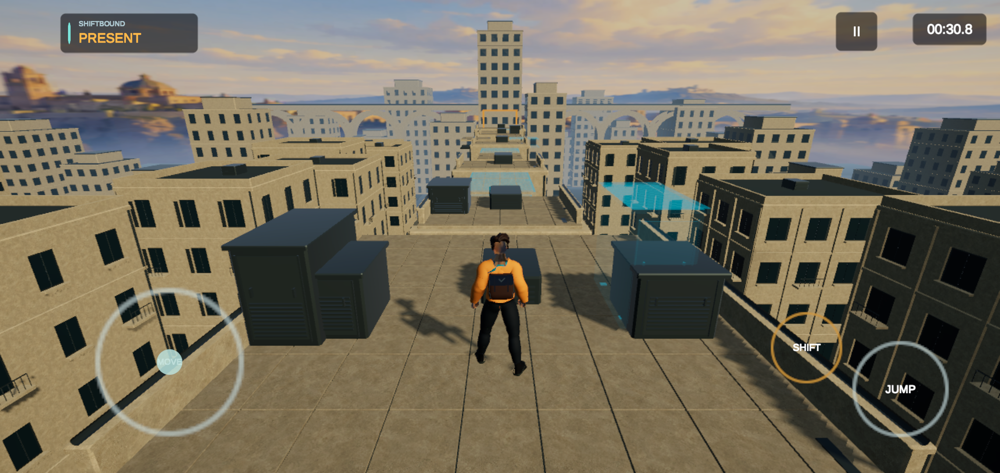
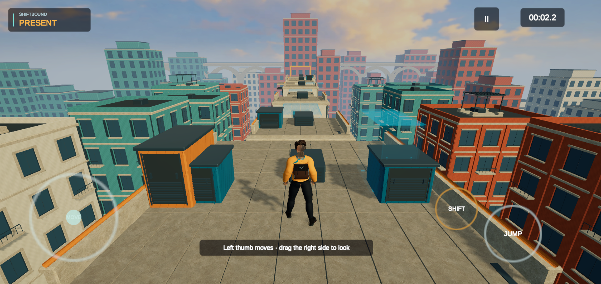
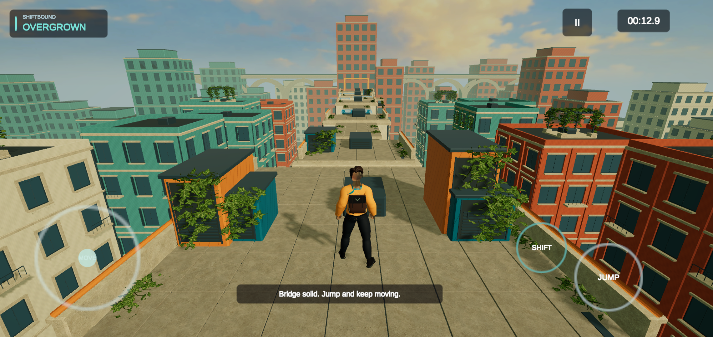

# Samsung review checkpoint - 10 October 2026

This is an unfinished production upgrade of the existing Present/Overgrown rooftop slice. No levels were added. Review the actual images and video before assigning a score; there is no independently established overall rating or claim of excellent production quality.

**Source to review:** branch `production/courier-city-upgrade`. Build22 is the visually inspected and automatically tested checkpoint. Build24 adds the owner's subsequently requested jump/landing corrections. Testing was then stopped at the owner's explicit request. Build24 compilation and installation are recorded in `build24.json`; **the images, gameplay and test results below belong to build22, not build24**. The environment/rendering changes are shared; the latest movement animation requires verification.

## Physical-device evidence

Samsung Galaxy S10+ SM-G975U, Android11/API30, Snapdragon855/Adreno640, RAM7395MB, display2280x1080/60Hz,4096-byte pages. The device was USB connected/charging. Unique device identifiers and raw private logs are excluded.

| Capture | Identity and limits |
|---|---|
| [Present before](before13-present.png) / [after](after22-present.png) | Real Samsung PNGs,2280x1080, opening position(0,.08,1), yaw0/pitch18.13 before;22 after. UI safe-area/control preferences differ. |
| [Overgrown before](before14-overgrown.png) / [after](after22-overgrown.png) | Real Samsung PNGs, same opening pose.14 before already includes early render repairs; this is not a pristine original13 Overgrown baseline. |
| [Automated gameplay](samsung22-automated-gameplay.mp4) | Actual Samsung22 rendering,120s, repeated production-input route, both-world camera orbits, real airborne Shift, falls/recovery/checkpoints/completion. Re-encoded1140x540 from native recording; recording affects performance. Synthetic input, not human fingers. |
| [Normal desktop Present](desktop22-present.png) / [Overgrown](desktop22-overgrown.png) | Matching22 source, D3D11 normal profile. Actual capture1280x910; same position/yaw/pitch/world, different aspect from phone. Not a pixel-matched comparison. |
| [Desktop mobile diagnostic failure](desktop22-mobile-diagnostic-failure.png) | Actual serialized mobile pipeline used, but colour severely clips. It is a failed diagnostic, not a proxy for phone appearance. Runtime variant/backend cause remains unconfirmed. |

## What caused the mobile quality difference

Confirmed: installed13 rendered1280x606 behind2280x1080 native UI, only31.5% of native scene pixels. Scene softness was substantial.22 renders1536x727 (about45% native pixels),2xMSAA,FSR sharpness.35,HDR32/ACES,GLES3,1024 main shadow/one cascade/35m,no mobile SSAO. See [runtime snapshot](render-state22.txt). This is a measured mobile budget, not the desktop profile copied wholesale or proof of sustained60FPS.

Confirmed shared art defects compounded the rendering difference: repetitive flat beige facades, weak contact/material response and a blurred painted second skyline disconnected from constructed scenery. Authored colour/material/surround/coping/service-equipment/terrace/attached-growth changes and the22 sky-UV repair address these. The courier outfit/rig, native HUD, texture binding, four skin weights and grading repairs from interrupted work were retained. [Provenance](../ProductionUpgrade/README.md) identifies original authoring and retained CC0 sources.

Not established: missing textures/material fallback or an unsupported shader in the installed13 baseline. Inspected foliage/sky textures loaded with supported shaders and mip0. The owner's older desktop video has unknown build identity. The desktop mobile-profile clipping remains a separate unresolved diagnostic. No claim that the Samsung is too weak, and no Vulkan superiority claim without a comparison.

## Motion and gameplay changes

22 has gait cadence calibrated to source clip length/stance travel, opposing arm/knee curves within the real ascent, running impact/contact polish, bounded camera ascent lag, eased3-degree running FOV, comfortable-action placement candidate and Jump-to-Shift slide ownership preserving Jump hold. Input never waits for animation. Instant retry retains the scene and resets motor/input/world/triggers/checkpoint/camera/audio/lessons, removing reload stalls.

The inspected22 footage still shows a tucked/stiff airborne courier, imperfect foot/contact behavior and abrupt pose changes. **24 reduces knee tuck, extends descent legs, authors a short landing compression/return, replaces the inherited half-height/1.27s body collapse with a3cm/0.16s landing response, disables airborne clip looping, and triggers takeoff from actual motor launch events including buffered contact jumps.** Height/gravity/collision/reach are unchanged.24 motion has not been watched on the device after the owner stopped testing.

## Verification and acceptance

22 full current-source automated suite passed:11 jump/18 touch assertions; regression, smoke and reach audit; synthetic touchscreen ownership/cancellation/simultaneous contacts/suspend-resume/retry; deterministic routes30/60/120/144/variable; production-input routes30/60/120/144; four retained-scene retry cycles. [Pass markers](automated-checks22.txt). These are22 results, not24 regression evidence. Physical22 automation also passed both-world full orbit, input-driven fall/checkpoint recovery and repeated complete routes.

22 unrecorded presentation run was stopped by owner after223.578s,8 completed routes,12,918 intervals. p50=16.923ms,p95=17.002ms,p99=33.862ms,max35.396ms;354 estimated missed60Hz slots (2.67%), no intervals over50ms, no polling errors/gaps. It is **not the requested20-minute acceptance**. USB charging/warm device; no cold-versus-sustained/unplugged conclusion. [Summary](performance22-summary.json), [minute/memory/thermal analysis](performance22-partial.json). Available counters have the limits of SurfaceFlinger presentation sampling; these are not FrameTimeline deadline attribution or physical input latency.

22 static APK inspection: all LOAD alignments16KB, ZIP16KB alignment and signature pass. libc++_shared.so,libmain.so,libunity.so RELRO ends fail; libgame.so/libswappywrapper.so and source-built libraries pass. [Exact report](artifact22.json). A supported vendor-runtime fix remains required; no binary patch/mixing.24 has not been freshly inspected. AAB-generated APKs and a separate16KB runtime remain unverified. This4KB phone does not establish16KB support.

| Production acceptance category | Status | Evidence/remaining work |
|---|---|---|
| Samsung visual quality | FAIL |22 looks clearer/more colourful, but repeated architecture, flat glazing, weak skyline depth/contact remain below the requested production bar. |
| Courier and motion | NOT VERIFIED |22 pose defects observed;24 corrections require device review. |
| Two-thumb interaction and camera | NOT VERIFIED |Automation passed functional routes; no human finger comfort or24 camera/motion acceptance. |
| Sustained Samsung performance | NOT VERIFIED |Owner stopped the planned20-minute run;22 short run shows2.67% missed slots. |
| Lifecycle, recovery and persistence | NOT VERIFIED |22 automated recovery/retry pass; actual-device rotation, Back/Home/lock/resume and process-death checkpoint retention incomplete. Same-key updates preserved app data. |
| Android artifact compatibility | FAIL |Known22 vendor RELRO failures;24 fresh inspection/AAB/16KB runtime missing. |
| Independent human/art evaluation | NOT VERIFIED |No independent review or player session has been completed. |

## Independent review request

Inspect the branch source, native before/after PNGs and device video. Identify the strongest improvements and largest remaining player-facing weaknesses, prioritizing mobile readability, courier motion/contact, landing visibility, world coherence and pacing. Rate only aspects you can substantiate and disclose that24 motion is newer than the footage. Do not infer thumb comfort, sustained performance or16KB compatibility from screenshots or a passing scripted route. Do not average a failed major gate into overall production acceptance.

Optional future hands-on retest, only when the owner wants it: move forward, hold Jump and slide that thumb onto Shift before landing; immediately reverse after landing and retry once after a fall. Report the single worst input/camera issue. No physical-comfort result is claimed now.

